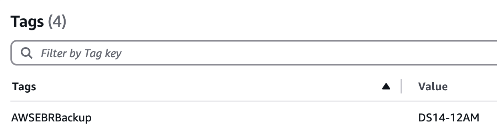
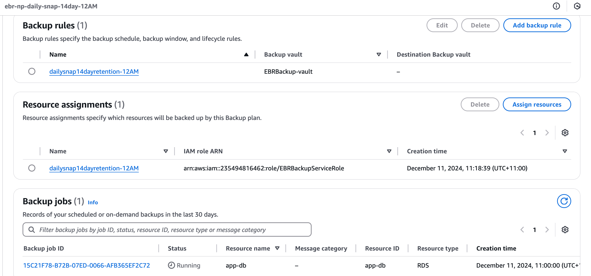
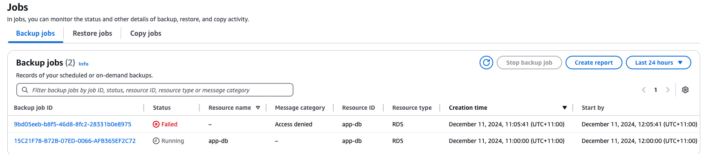
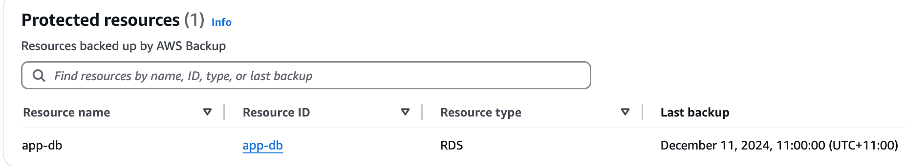

An AWS Backup Vault is a container that stores and organizes your backups created using AWS Backup. Here's why it's important and why you might need to create a backup vault:

# Purpose of aws_backup_vault

1. Centralized Storage for Backups:
   A backup vault serves as a centralized location to store and manage backups (referred to as recovery points) created across different AWS services, such as EC2, RDS, EFS, DynamoDB, and more.

2. Separation of Concerns:
   By creating multiple backup vaults, you can logically separate backups based on business needs, compliance requirements, or environment (e.g., development, testing, production).

3. Access Control:
   You can apply AWS Identity and Access Management (IAM) policies and resource-based policies to control who can access and manage the backups within a vault.

4. Security and Encryption:
   Backup vaults allow you to specify the encryption settings for the backups stored in the vault. Each vault is associated with an AWS Key Management Service (KMS) key to ensure data is encrypted at rest.

5. Retention Policies and Lifecycle Management:
   Backup vaults let you apply lifecycle policies to automatically transition recovery points to cold storage or delete them after a specified period, reducing costs.

6. Monitoring and Audit Logging:
   AWS Backup integrates with AWS CloudTrail to track API calls related to your backup vaults. It also supports Amazon CloudWatch for monitoring and setting alarms.

# Purpose of aws_backup_vault - AWS Backup Plan Resource

The `aws_backup_plan` resource in AWS is used to define a backup strategy or policy that governs how AWS Backup performs backups for your resources. It specifies the schedule, lifecycle rules, retention period, and the backup vault where the backups will be stored.

## Key Purpose of `aws_backup_plan`:

### Backup Schedule:

- Defines when the backup should occur (e.g., daily, weekly) using a cron expression or rate (e.g., at 3pm or 6pm or 8pm or 10pm or 1am).

### Retention Period:

- Specifies how long backups (say 14 days) should be retained in the backup vault before being deleted. This helps in managing backup storage costs and ensures compliance with retention policies.

### Backup Vault:

- Determines where the backups will be stored, i.e., the backup vault (e.g., an encrypted vault using a KMS key).

### Resource Selection:

- Associates backup resources (e.g., EC2 instances, RDS databases, EFS volumes) with the backup plan. Resources are tagged or selected based on their properties to ensure they're included in the backup plan. E.g. select RDS which as Tag as AWSEBRBackup - DS14-1AM

### Lifecycle Management:

- Controls how backup recovery points are managed throughout their lifecycle. You can set rules to transition or delete backups based on age.

### Tagging:

- Tags can be applied to backups, making it easier to identify and manage backups by their lifecycle status or associated policies.

## Main Components of a Backup Plan:

### Name:

- Specifies a unique name for the backup plan.

### Backup Rules:

- Defines specific rules for creating backups. For each rule, you can set:
  - **Schedule**: Cron expressions or rate of backup creation.
  - **Lifecycle**: How long backups are retained and when they are deleted.
  - **Recovery Point Tags**: Metadata that helps in identifying backups.
  - **Recovery Window**: The time within which a backup must be completed.

### Backup Vault:

- Where the backups are stored. This is often associated with encryption via an AWS KMS key for security.

# Verification

- RDS was tagged as
  

- Backup plan was created for 12AM UTC and for resources which are assigned tags as AWSEBRBackup - DS14-12AM
  

- Job output
  

- Once backup is done, it shows in Protected resource
  
